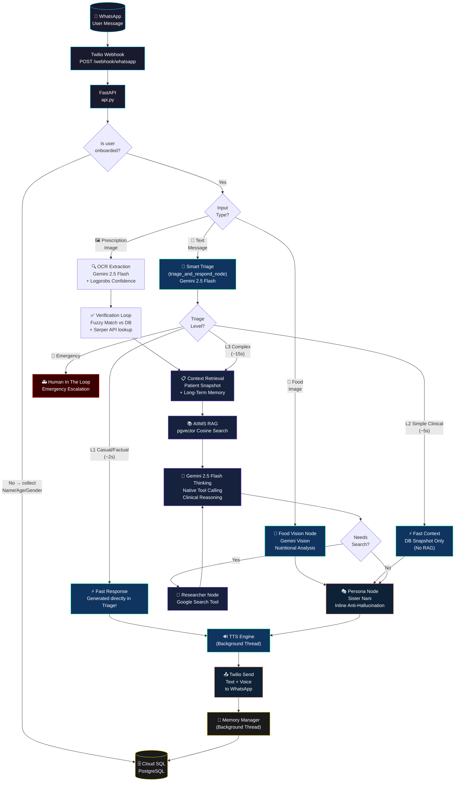

# Sister Nani — Full Architecture Diagrams

## Current Architecture (v2 — Deployed)

---

## Latency Comparison

```mermaid
xychart-beta
    title "Response Latency: Before vs After"
    x-axis ["L1 (Hi)", "L2 (Allergies?)", "L3 (Chest Pain)"]
    y-axis "Seconds" 0 --> 120
    bar [11, 15, 120]
    bar [2, 5, 18]
```

---

## Node Inventory

| Node | Model Used | Path |
|---|---|---|
| **Triage & Fast Respond** | Gemini 2.5 Flash | L1 Fast Path (All casual/factual queries) |
| **OCR Extraction** | Gemini 2.5 Flash + Logprobs | Prescription images |
| **Verification Loop** | Gemini + Serper + FuzzyMatch | Post-OCR |
| **Food Vision** | Gemini Vision | Food images |
| **Context Retrieval** | PostgreSQL JOIN | L3 full path |
| **AIIMS RAG** | pgvector + VertexAI Embeddings | L3 full path |
| **Reasoning** | Gemini 2.5 Flash Thinking | L3 full path |
| **Researcher** | Google Search Tool (Native) | L3 on demand |
| **Persona/Communicator** | Gemini 2.5 Flash | L2, L3, Nutrition paths |
| **Memory Manager** | Gemini 2.5 Flash + pgvector | Async background |
| **TTS Engine** | Gemini Audio | Async background |
